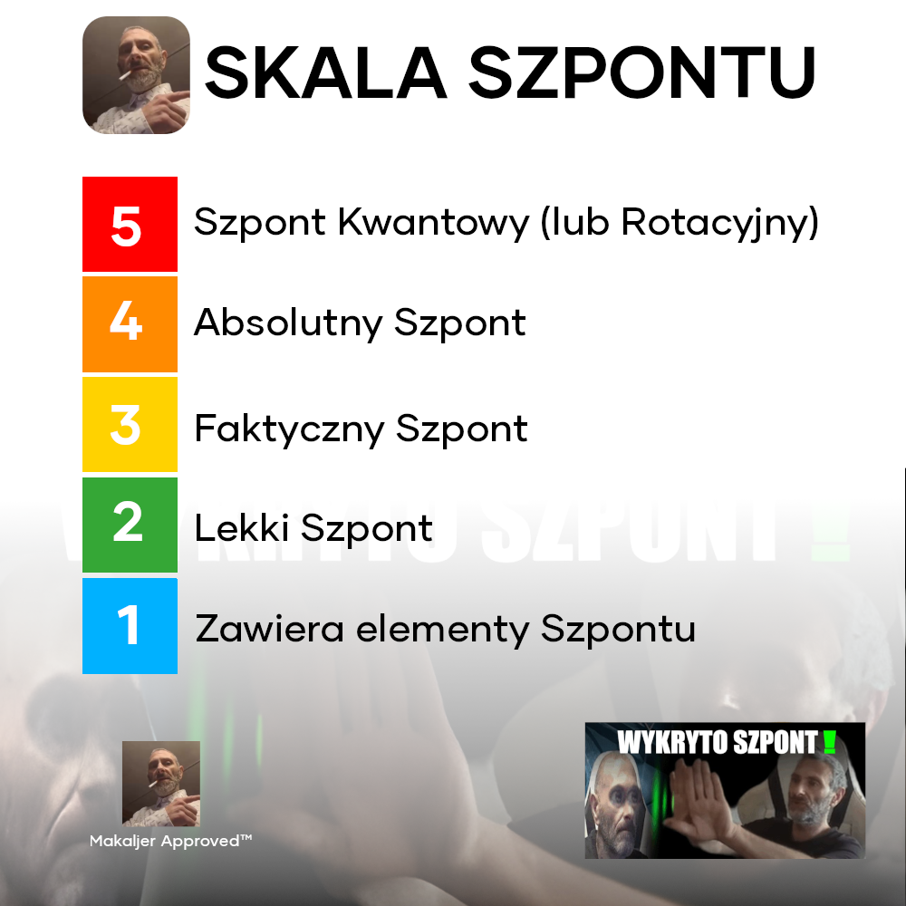

# Dzienniczek Szpontniczek

[](https://github.com/szponciciel04/DzienniczekSzpontniczek)
[](https://github.com/szponciciel04/DzienniczekSzpontniczek)
[](https://github.com/szponciciel04/DzienniczekSzpontniczek/commits)
[](https://github.com/szponciciel04/DzienniczekSzpontniczek/issues)
[](https://github.com/szponciciel04/DzienniczekSzpontniczek)

Dzienniczek Szpontniczek (codename: Szpontium) to pierwszy w pełni naszponcony client eduVULCAN

## CLI

Repozytorium zawiera również `dzienniczek`: wieloplatformowy interfejs wiersza poleceń dla VULCAN, eduVULCAN i Librus. Działa na Linuxie, macOS (Homebrew) oraz Windows przez WSL, obsługuje wyjście JSON i stabilne kody wyjścia dla Codex, Claude Code, OpenClaw i Hermes.

```sh
./scripts/install.sh
dzienniczek login eduvulcan --username USER --password PASS
dzienniczek dashboard
dzienniczek capabilities --json
```

Pełna instrukcja: [docs/cli.md](docs/cli.md).

Projekt został całkowicie przyszponcony w paru promptach przy użyciu Szpont Maszyny z modelem Claude Sonnet 4.6


## Funkcje aplikacji

Dzienniczek Szpontniczek pozwala korzystać z najważniejszych funkcji e-dziennika VULCAN i eduVULCAN w jednej aplikacji.

- logowanie i rejestracja urządzenia dla Dzienniczka VULCAN oraz eduVULCAN,
- podgląd ocen, średnich i podsumowań okresowych,
- przegląd sprawdzianów, kartkówek i zadań domowych,
- plan lekcji (w tym zastępstwa) oraz lekcje zaplanowane i zrealizowane,
- frekwencja wraz ze statystykami miesięcznymi i przedmiotowymi,
- uwagi, ogłoszenia i wiadomości,
- informacje o nauczycielach, szkole, wycieczkach, wydarzeniach i dniach wolnych.

## Skala Szpontu



Cały projekt uplasował się na miejscu "Szpont Kwantowy" w Skali Szpontu

## Dokumentacja

Więcej szczegółów znajdziesz w dokumentacji projektu:

- [Getting started](docs/getting-started.md)
- [Basic usage](docs/basic-usage.md)
- [Logowanie i klient HebeCE](docs/login-and-hebece-client.md)
- [Flow logowania eduVULCAN](docs/eduvulcan-login-flow.md)
- [Prometheus login helper](docs/prometheus-login-helper.md)

UWAGA! ta dokumentacja jest całkowcie przyszponcona przez Szpont Maszynę.

## Podziękowania

Serdeczne podziękowania dla Szpont Maszyny która pozwoliła naszponcić cały ten projekt 
Dziękujemy aplikacji Szkolny.eu za użycie kodu do działania dziennika Librus.
